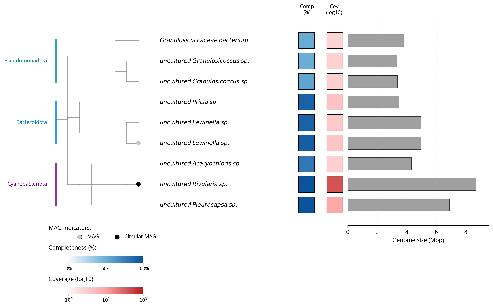
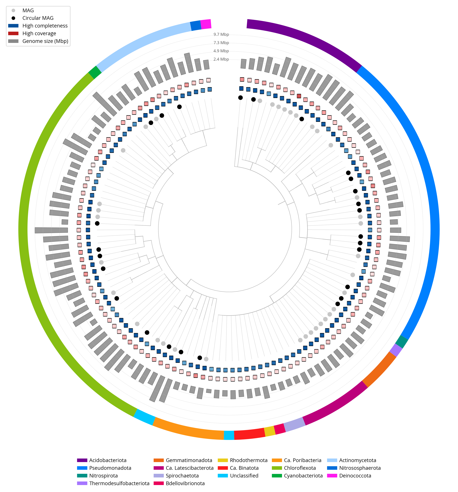

# metagenome-report

Generate a metagenome bin summary table and annotated tree figure from
`bin_data.csv` files produced by the Tree of Life assembly/binning/QC
pipeline.  Outputs land in `~/gn_assets/metagenome_figs/<tolid>/` for
direct use in genome notes.


## Requirements

```
pandas  numpy  matplotlib  tabulate  num2words
```

Optional (for taxonomy-based tree layout):

```
ete3
```

Install the package and its core dependencies:

```bash
pip install -e .
# with ete3 support:
pip install -e ".[tree]"
```


## Input

Each sample is expected to have a `bin_data.csv` derived from th metagenome assembly pipeline under:

```
~/gn_assets/metagenomes/<tolid>/bin_data.csv
```

The CSV must contain a `bin_id` column.  The tool recognises flexible
column naming (e.g. `Completeness` or `completeness`, `classification`
or `gtdb_taxonomy`, etc.) so files from different pipeline versions
should work without modification.


## Output

All outputs are written to `~/gn_assets/metagenome_figs/<tolid>/`
(override with `--outdir`):

| File | Description |
|---|---|
| `metagenome_tree.png` | Annotated bin tree figure (rectangular ≤50 bins, circular >50 bins) |
| `metagenome_bins_table.md` | Markdown summary table of bins |
| `metagenome_bins_table.csv` | Same table as CSV |
| `metagenome_context.json` | Context dict for genome note Jinja2 templates |
| `tree_assets/taxonomy_tree.nwk` | Newick tree (written when `--build-tree` is used) |
| `tree_assets/taxonomy_tree.json` | Bin order + rank metadata for the Newick tree |


## Usage

```bash
# Minimal — auto-finds CSV from tolid
metagenome-report --tolid glLicPygm2

# Explicit CSV path
metagenome-report --csv /path/to/bin_data.csv --outdir /path/to/output

# Build a GTDB-based taxonomy tree first, then plot with that topology
metagenome-report --tolid glLicPygm2 --build-tree

# Re-use a previously built taxonomy tree
metagenome-report --tolid glLicPygm2 --order-json ~/gn_assets/metagenome_figs/glLicPygm2/tree_assets/taxonomy_tree.json

# Allow NCBI taxon_id lookups when building the tree (needs ete3 + NCBI db)
metagenome-report --tolid glLicPygm2 --build-tree --use-taxid --ncbi-db ~/ncbi_taxadb.sqlite

# Only write table + context JSON, skip figure
metagenome-report --tolid glLicPygm2 --skip-figure

# Custom DPI and filename
metagenome-report --tolid glLicPygm2 --dpi 600 --filename metagenome_tree_hires.png
```

Run as a module if the entry point is not on your PATH:

```bash
python -m metagenome_report.cli --tolid glLicPygm2
```


## Reading the figures

### Rectangular layout (≤50 bins)

Used when the sample has 50 or fewer bins.



*Example: Lichina pygmaea (glLicPygm2), 9 bins.*

The figure has four panels left to right:

- **Tree / phylum panel** — bins are listed as horizontal lines. Coloured vertical bars on the far left group bins by phylum, with the phylum name written beside each bar. If a taxonomy-ordered Newick tree is available (`--build-tree`), the branching topology is drawn; otherwise bins are sorted by phylum/class/order/family.
- **Comp** — a coloured square per bin showing CheckM completeness on a white→blue gradient (dark blue = 100%).
- **Cov** — a coloured square per bin showing mean read coverage on a white→red gradient (log₁₀ scale).
- **Genome size** — horizontal bar showing assembly size in Mbp.

A filled circle on the branch endpoint marks MAGs: **grey** for a standard MAG, **black** for a fully circular MAG (see [MAG classification](#mag-classification) below).

---

### Circular layout (>50 bins)

Used when the sample has more than 50 bins.



*Example: Aiolochroia crassa (odAioCras1), 123 bins.*

Bins are arranged around a polar axis (a small gap is left at the top). Working outward from the centre:

- **Tree branches** — grey lines showing the taxonomy-derived topology (if available), or straight radial lines otherwise.
- **MAG dot** — a filled circle at the branch tip: grey = MAG, black = fully circular MAG.
- **Comp square** — blue-gradient square, completeness.
- **Cov square** — red-gradient square, log₁₀ mean coverage.
- **Genome size bars** — radial bars; dashed rings with Mbp labels provide a scale.
- **Phylum colour ring** — outermost arc coloured by phylum (legend at the bottom).

Tip labels (species/genus names) are shown only when there are ≤30 bins.

---

### MAG classification

A bin is classified as a **MAG** if it passes all of the following thresholds (applied in order):

| Criterion | Threshold |
|---|---|
| Contamination | ≤ 5% |
| rRNA operon | 5S, 16S, and 23S all present (`Y`) — when columns are present |
| Unique tRNAs | ≥ 18 — when column is present |
| Completeness (high) | ≥ 90% |
| Completeness (medium) + fully circular | ≥ 50% **and** every contig in the bin is circular |

The **fully circular** condition requires that the number of circular contigs equals the total number of contigs (e.g. a single circular chromosome, or multiple circular contigs with no linear ones).

MAGs need to be **unique** for a taxon - taxonomid duplicates are not considered to be MAGs.

If a `bin_type` column is present in the CSV (populated by the pipeline), its value overrides the rule-based classification: any value containing `mag` (case-insensitive) is treated as a MAG.


The figure uses Open Sans if available (`GENOMENOTES_FONT` env var can
point to an explicit `.ttf` path).


## Taxonomy-ordered tree

Without `--build-tree`, bins are arranged in the figure sorted by
phylum/class/order/family but with no tree topology drawn.  Adding
`--build-tree` constructs a rank-aware Newick tree from the taxonomy
strings in the CSV, which the figure then uses for branch layout.

### How taxonomy is resolved

The tree builder works through two sources in order of preference:

**1. Classification strings (default — no NCBI database required)**

The `ncbi_classification` column (preferred) or `classification` column
are parsed directly.  Both contain semicolon-delimited GTDB-style rank
strings already present in the CSV:

```
ncbi_classification: d__Bacteria;p__Cyanobacteriota;c__Cyanophyceae;o__Pleurocapsales;f__Hyellaceae;g__Pleurocapsa
classification:      d__Bacteria;p__Cyanobacteria;c__Cyanobacteriia;o__Cyanobacteriales;f__Xenococcaceae;g__Pleurocapsa
```

`ncbi_classification` uses NCBI taxonomy names; `classification` uses
GTDB names (which can differ, e.g. `p__Cyanobacteria` vs
`p__Cyanobacteriota`).  This path works entirely offline and is what
runs in practice — all bins in the current data have at least one of
these columns populated.

**2. NCBI taxon ID fallback (`--use-taxid`)**

If a bin has no classification string, the `taxon_id` column is used to
query a local copy of the NCBI taxonomy database via `ete3.NCBITaxa`.
This requires the SQLite database at `~/ncbi_taxadb.sqlite` (635 MB,
built from the NCBI taxdump with `NCBITaxa().update_taxonomy_database()`).

```bash
metagenome-report --tolid odAioCras1 --build-tree --use-taxid --ncbi-db ~/ncbi_taxadb.sqlite
```

The database maps taxon IDs to their full NCBI lineage (superkingdom →
phylum → class → order → family → genus → species).

### Two-step workflow

Run `--build-tree` once to write `tree_assets/`; subsequent runs pick it
up automatically:

```bash
# Step 1 — build tree (only needed once per sample)
metagenome-report --tolid odAioCras1 --build-tree

# Step 2 — regenerate figure (e.g. at higher DPI) without rebuilding
metagenome-report --tolid odAioCras1 --dpi 600
```


## Batch workflow

Pass multiple tolids directly:

```bash
metagenome-report --tolids glLicPygm2 glLicPygm3 odAioCras1
```

Or supply a text file with one tolid per line (lines starting with `#` are ignored):

```bash
metagenome-report --tolids-file my_tolids.txt
```

Example `my_tolids.txt`:
```
# sponges
odAioCras1
odCarFoli1
# lichens
glLicPygm2
glLicPygm3
```

All other flags (`--build-tree`, `--dpi`, `--skip-figure`, etc.) apply to every sample in the batch. Each sample writes to its own `~/gn_assets/metagenome_figs/<tolid>/` directory. Samples that fail are reported at the end and do not stop the rest of the batch.


## Files

```
metagenome_report/
  cli.py            Command-line entry point
  report.py         build_context() and write_table()
  tree_figure.py    MetagenomeTreeFigure (rectangular + circular layouts)
  taxonomy_tree.py  TaxonomyTreeBuilder using ete3
pyproject.toml
```
